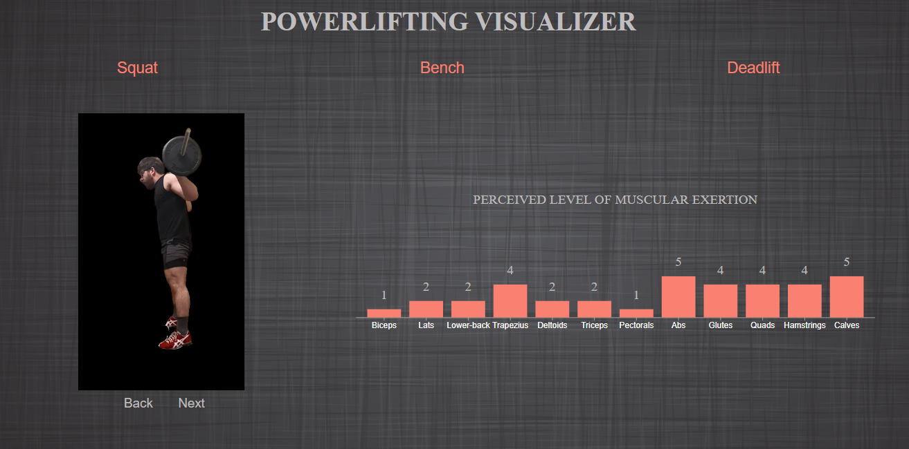

# Powerlifting Visualizer
Powerlifting website that teacher proper form and muscular utilization during powerlifting movements.
[Visit Live Site](https://apodavonov3616.github.io/powerlifting-visualizer/)
This website was created to teach proper techniques of the three powerlifting movements: squat, bench, and deadlift. Using the interactive demo, you can progress through different points in the lift (shown with an image) and take note tips on form as well as level of muscle utilization!

## In the Powerlifting Visualizer, users will be able to:
-Click on squat, bench, and deadlift sections 
-Click through different stages of the lift
-Hover over the picture to see the tips recommended at the current portion of the lift

## Technologies:
This demo utilizes vanilla javascript, HTML, CSS D3.js, webpack, and canvas. The data and images were created by myself.
